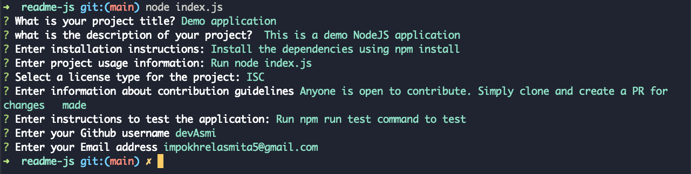

# readme-js

## Table of contents

[Description](#description)

[Installation](#installation)

## Description

This command line applicaton is used to create a professional README file for a repository. It will ask the users to provide the details such as description, installation instructions, usage for the application, etc and will generate a README file based on the information user provided.

## Usage Information

The user can run the index.js script using NodeJS with the following command:

`node index.js`

This will present the users with multiple questions that they can answer.

## Contribution Guidelines

If anyone is open to modify and make contributions, they can clone the repo and make changes on a feature branch. They can then open a Pull Request and ask for a review.

## License

Licensed under the [MIT](https://choosealicense.com/licenses/mit) license.

## Video demo and link

[Video Link](https://drive.google.com/file/d/1m_Hy9mQIorrIOQu6FXTLvBTCN1X45x6l/view)

## Screenshots

